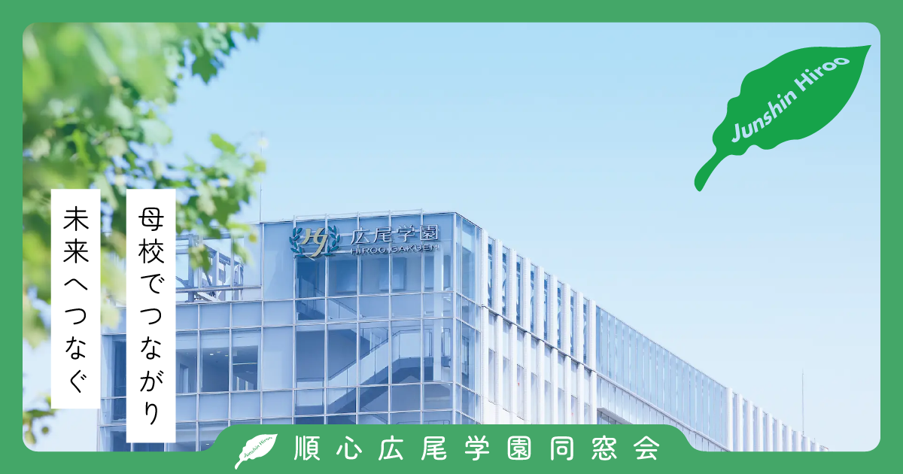
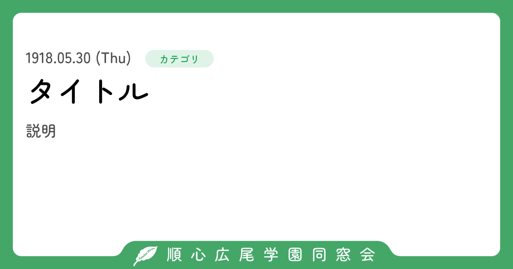
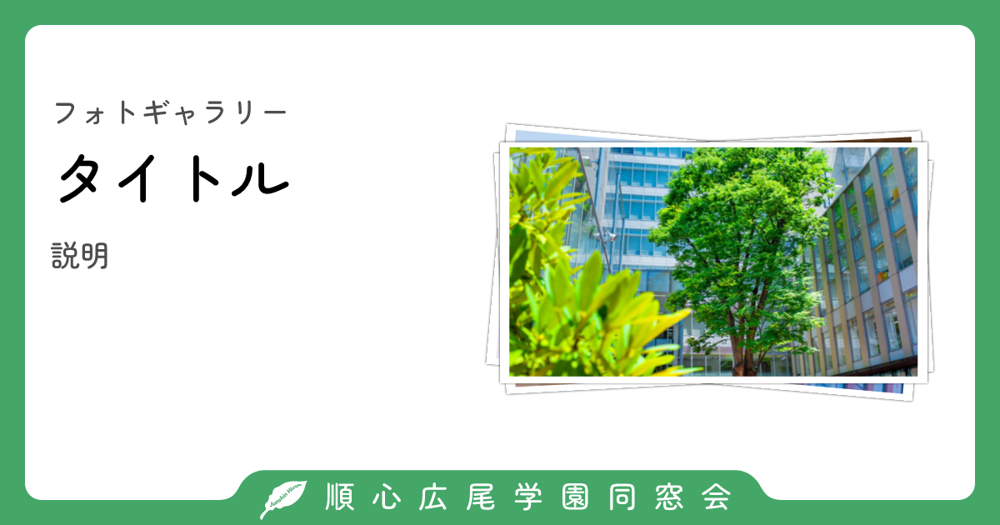

# OG Image Worker

順心広尾学園同窓会サイトの OGP 画像を返す Cloudflare Worker です。トップページの固定画像と、ページの情報から生成する「お知らせ」「フォトギャラリー」の 3 形式があります。

`apps/web` は公開ページと同じ URL の `?og` リクエストをルートミドルウェアで受け、Cloudflare Service Binding 経由でこの Worker を呼び出します。例えば `/notice/example?og` が PNG を返し、通常の `/notice/example` はその URL を `og:image` と `twitter:image` に設定します。

## 出力サンプル

### トップページ（`landing`）



`src/assets/toppage.png` をそのまま返す固定画像です。サイトのトップページで使用します。

### お知らせ・汎用ページ（`news`）



`title` と `description` を主体にした汎用フォーマットです。画像は `publishedAt` と `category` も渡した場合の表示例です。お知らせ詳細のほか、通常の固定ページでは `title` と `description` だけを渡して使用します。

### フォトギャラリー（`gallery`）



`title` と `description` に加え、最大 3 枚の写真を重ねて表示するフォーマットです。ギャラリー一覧では全写真から、アルバム詳細では対象アルバムから、CDN キャッシュの再生成時にランダムな 3 枚を選びます。

## 仕様

- 出力形式: PNG
- サイズ: 1200 × 630 px
- 日本語フォント: Zen Maru Gothic 500
- 改行位置: BudouX で日本語の文節を考慮
- レンダラー: `takumi-js`
- キャッシュ: Cloudflare CDN のみ 24 時間（ブラウザは `no-store`）
- 共通フレーム: `src/assets/frame.svg`

### 内部 API

API は Hono OpenAPI で定義され、すべて `image/png` を返します。通常は `apps/web` から型付き Hono Client で呼び出し、外部公開 URL としては使いません。

| 形式 | エンドポイント | 必須データ | 任意データ |
| --- | --- | --- | --- |
| `landing` | `/v1/landing` | なし | なし |
| `news` | `/v1/news` | `title: string` | `description: string`, `category: string`, `publishedAt: ISO 8601 datetime` |
| `gallery` | `/v1/gallery` | `title: string`, `images: URL[]` | `description: string` |

`gallery.images` は最大 3 件で、Worker から取得できる絶対 URL が必要です。OpenAPI スキーマは開発サーバーの `/openapi.json`、Swagger UI は `/ui` で確認できます。

## セットアップ

リポジトリのルートで依存関係をインストールします。

```sh
bun install
```

Worker 設定から Cloudflare の型定義を生成し、TypeScript の型チェックと `dist` の型宣言生成を行います。

```sh
bun run --cwd apps/ogimage typecheck
```

サイトと OG Image Worker を同時に起動するときは、リポジトリルートから実行します。

```sh
bun run dev
```

OG Image Worker だけを起動する場合は次のコマンドを使います。

```sh
bun run --cwd apps/ogimage dev
```

## Cloudflare 設定

OG Image Worker 自身は `apps/ogimage/wrangler.jsonc` で、共通フレームや固定画像を `ASSETS` binding から読み込みます。

```jsonc
{
  "name": "ogimage",
  "main": "src/index.ts",
  "cache": {
    "enabled": true
  },
  "assets": {
    "directory": "./src/assets",
    "binding": "ASSETS"
  }
}
```

Worker のレスポンスは `Cache-Control: no-store` でブラウザ保存を禁止し、`Cloudflare-CDN-Cache-Control: public, max-age=86400` で Cloudflare CDN だけに 24 時間保存します。Cloudflare 専用ヘッダーはクライアントへ転送されません。詳細は [Cloudflare の CDN-Cache-Control 仕様](https://developers.cloudflare.com/cache/concepts/cdn-cache-control/) を参照してください。

Web Worker 側の `apps/web/wrangler.jsonc` には、OG Image Worker を呼ぶ Service Binding と Workers Caching の設定が必要です。`service` は OG Image Worker の `name` と一致させます。

```jsonc
{
  "cache": {
    "enabled": true
  },
  "services": [
    {
      "binding": "OG_IMAGE",
      "service": "ogimage"
    }
  ]
}
```

公開 URL への最終レスポンスは Web Worker が返すため、`apps/web/app/lib/og-image.ts` でも OG 画像の成功レスポンスに同じ 2 つのキャッシュヘッダーを設定します。また、Web Worker 全体のキャッシュを有効にしても OG 以外が保存されないよう、`apps/web/workers/app.ts` は Cloudflare 専用ヘッダーが未設定のレスポンスに `Cloudflare-CDN-Cache-Control: no-store` を付与します。このヘッダーはブラウザへ転送されないため、通常の HTML やサイトマップのブラウザキャッシュ指定は変更しません。

デプロイ時は Service Binding の参照先を確実に存在させるため、OG Image Worker、Web Worker の順にデプロイします。

```sh
bun run --cwd apps/ogimage deploy
bun run --cwd apps/web deploy
```

## Web ルートに OG 画像を設定する

### `news` 形式

固定ページでは、SEO メタデータと OG 画像で同じ title / description を共有します。`dynamicOg: true` にすると、`buildMeta` がそのページの `?og` URL を `og:image` と `twitter:image` に設定します。

```tsx
import { ogImage } from "~/lib/og-image";
import { buildMeta } from "~/lib/seo";

const TITLE = "ページタイトル";
const DESCRIPTION = "ページの説明文です。";

export const middleware = [
  ogImage(() => ({
    type: "news",
    body: { title: TITLE, description: DESCRIPTION },
  })),
];

export function meta() {
  return buildMeta({
    title: TITLE,
    description: DESCRIPTION,
    path: "/example",
    dynamicOg: true,
  });
}
```

お知らせのような動的ルートでは、resolver 内でデータを取得します。データが存在しない場合は `null` を返すと `?og` が 404 になります。

```tsx
export const middleware = [
  ogImage(({ params }) => {
    const item = getItem(params.slug ?? "");
    if (!item) return null;

    return {
      type: "news",
      body: {
        title: item.title,
        description: item.description,
        category: item.category,
        publishedAt: item.publishedAt,
      },
    };
  }),
];
```

### `gallery` 形式

画像 URL は `url` を基準に絶対 URL へ変換してから渡します。API の上限に合わせ、必ず最大 3 枚にします。

```tsx
export const middleware = [
  ogImage(({ url }) => ({
    type: "gallery",
    body: {
      title: "フォトギャラリー",
      description: "ギャラリーの説明文です。",
      images: shuffle(getGalleryImages())
        .map(image => image.fullWebpSrc)
        .filter((image): image is string => Boolean(image))
        .slice(0, 3)
        .map(image => new URL(image, url).toString()),
    },
  })),
];
```

## リクエストの動作

- `?og` のない通常リクエストはそのまま React Router へ渡します。
- `?og` の `GET` / `HEAD` だけを OG 画像リクエストとして処理します。その他のメソッドは 405 を返します。
- resolver が `null` を返した場合は 404 を返します。
- OG Image Worker が失敗した場合、または image 以外を返した場合は 502 を返します。
- `HEAD` ではレスポンスボディを返しません。

## 主なファイル

| パス | 役割 |
| --- | --- |
| `src/index.ts` | API ルートと PNG レスポンス |
| `src/routes/ogimage.ts` | OpenAPI / Zod の入出力スキーマ |
| `src/lib/get-og-image.tsx` | 1200 × 630 の共通レンダリング設定 |
| `src/components/news.tsx` | `news` 形式のレイアウト |
| `src/components/gallery.tsx` | `gallery` 形式のレイアウト |
| `src/assets/` | 固定画像と共通フレーム |
| `../web/app/lib/og-image.ts` | Web 側のルートミドルウェアと型付きクライアント |
| `../web/app/lib/seo.ts` | `?og` URL を OGP / Twitter Card に設定 |
